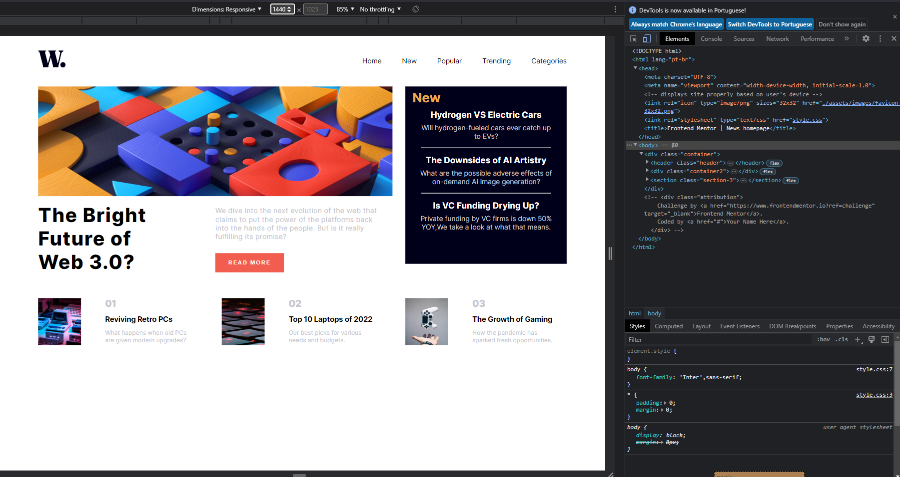

O desafio é construir a página inicial deste site de notícias e fazê-la parecer o mais próximo possível do design.

Você pode usar qualquer ferramenta que desejar para ajudá-lo a concluir o desafio. Portanto, se você tem algo que gostaria de praticar, sinta-se à vontade para tentar.

Seus usuários devem ser capazes de:

Veja o layout ideal para a interface, dependendo do tamanho da tela do dispositivo
Veja os estados de focalização e foco para todos os elementos interativos na página
